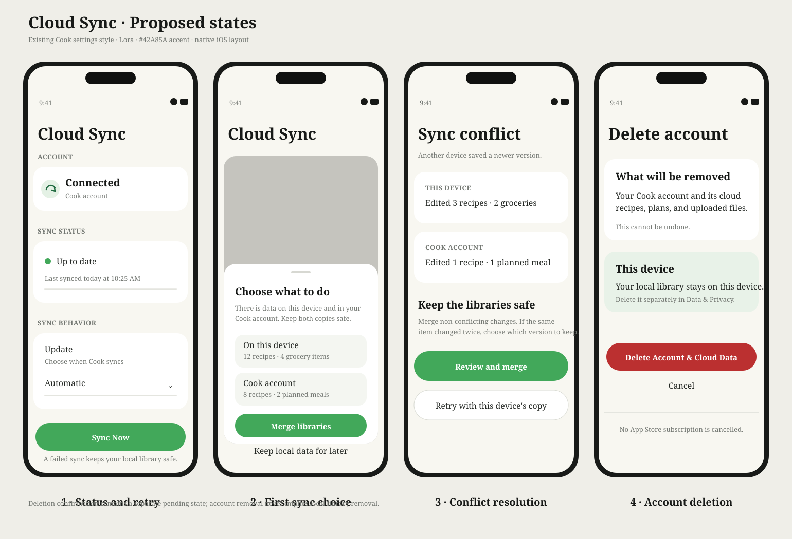

# Cloud Sync interaction proposal

Developer: gengyun

## Scope

Proposal for the existing Cloud Sync settings page and its first-sync/conflict states. It keeps the current native Cook settings style and documents the choices needed before two devices can safely share one snapshot.

## Proposed behavior

- Show the signed-in Cook account, last successful server sync, and the real sync state.
- Keep Automatic, Wi-Fi Only, and Manual as the three existing modes; expose Sync Now as the explicit retry/action.
- When local and cloud libraries both contain data for the first time, ask whether to merge or keep local data for later. Do not upload or replace either copy before the user chooses.
- On a concurrent edit, preserve the current local copy and show the server copy with an explicit merge/retry path. A stale client never overwrites a newer server revision silently.
- Keep account deletion separate from local-library deletion and use a second confirmation before deleting the account and its cloud data.

## Approval boundary

This is a proposal only. The settings page, first-sync prompt, conflict screen, and account-deletion confirmation remain pending. No formal UI implementation is authorized until the user confirms this proposal and the approvals table is updated.

## Visual

