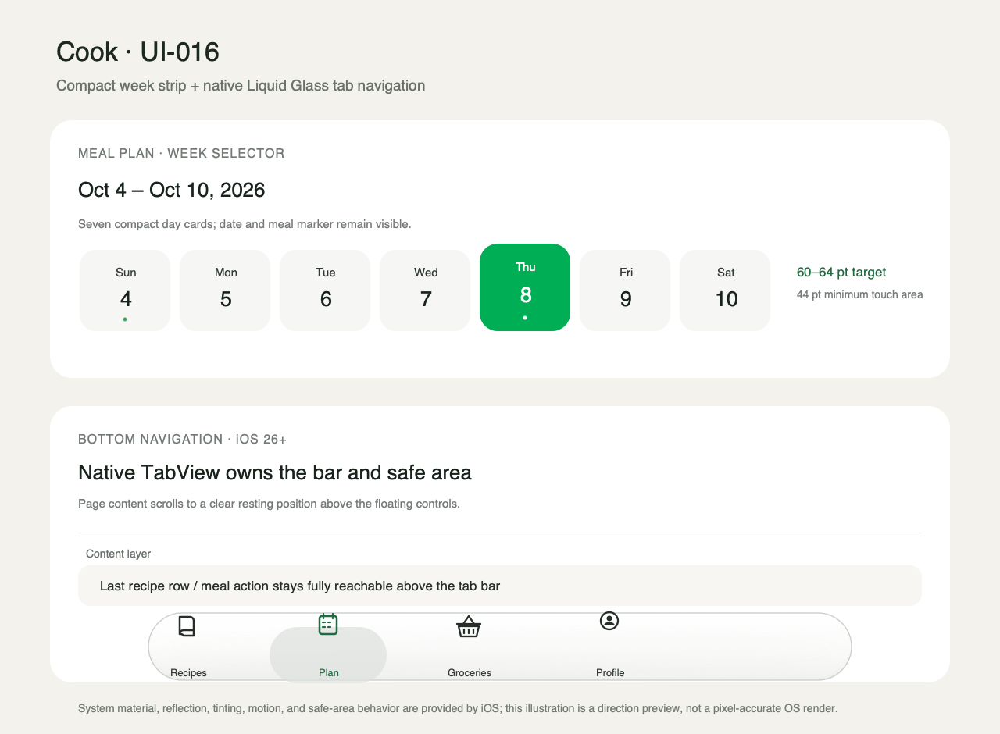

# UI-016：底部导航与周日期条

状态：按用户 2026-10-08 的直接修改要求执行。

## 输入与范围

- 用户于 2026-10-08 提供的 Recipe、Meal Plan 与底部 tab 截图及红框标注。
- 保留 Recipes / Plan / Groceries / Profile 四个 tab、现有图标语义、导航栈和各页功能。
- 降低 Meal Plan 的周日期卡片高度。
- 让底部导航不遮挡可操作内容，并采用 Apple 原生 Liquid Glass 外观。

## 方案

1. 周日期卡片把竖向留白和日期/星期行距收紧，目标高度约 60–64 pt；按钮可点击高度不低于 44 pt，字号、星期、日期和用餐标记都保留。
2. 用标准 SwiftUI `TabView` 呈现四个主区域，移除自绘胶囊 tab 与其自定义底部 inset。由系统处理 tab safe area、选中状态和平台外观；iOS 26+ 使用系统 Liquid Glass，最低支持的旧 iOS 仍使用平台原生 tab 样式。
3. 内容保持标准 `List` / `ScrollView` 布局，不在各页重复补固定底边距。系统 tab 负责底部安全区；滚动内容抵达末尾时应能完整滚到 tab 上方。
4. 保留 Cook 绿色作为系统 tab 的 tint。tab 背景、反射、模糊和选中形态交给系统，不叠加第二层自制玻璃背景、强描边或大面积不透明填色。

## 设计图

矢量源文件：[ui-016-navigation-and-week-strip.svg](ui-016-navigation-and-week-strip.svg)。红框原图在本次对话中作为问题定位参考；本方案图展示拟采用的目标状态。

## 平台依据

- [Apple HIG：Tab bars](https://developer.apple.com/design/human-interface-guidelines/tab-bars)：iOS tab bar 位于内容上方，使用 Liquid Glass，允许内容在其下方显露；建议持续显示主导航。
- [Apple：Applying Liquid Glass to custom views](https://developer.apple.com/documentation/swiftui/applying-liquid-glass-to-custom-views)：SwiftUI 标准组件已采用 Liquid Glass；自定义效果适用于确需自定义控件的场景。
- [Apple：TabView](https://developer.apple.com/documentation/swiftui/tabview)：标准 SwiftUI tab 容器。

## 验收方向

- Meal Plan 周日期卡片比现状明显更矮，7 天在当前横向滚动布局中保持可读、可点。
- Recipes、Plan、Groceries、Profile 在底部滚动到末尾时，最后一个控件/列表行都可完整滚动到导航栏上方。
- iOS 26+ tab 显示系统 Liquid Glass 外观；选中态仍与 Cook 绿色一致，四个 tab 可访问性名称和导航状态不变。
- 二级页面、做饭全屏路径、键盘和动态字体不被 tab safe-area 调整破坏。

## 实施范围

- 使用系统原生 tab bar，不再叠加自绘玻璃效果。
- 周日期卡片收紧竖向留白，同时保留至少 44 pt 的点击高度。
