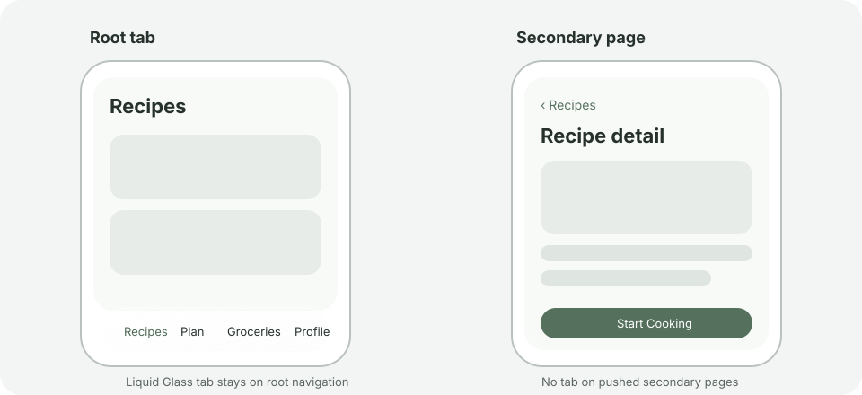

# UI-017: Secondary page navigation

This proposal records the navigation behavior requested for secondary pages. It reuses the approved UI-016 root navigation and existing page designs; it does not redesign page content.

## Proposed behavior

- Root tabs keep the native Liquid Glass tab bar from UI-016, with no custom opaque white background layer.
- Pushing a secondary page hides the tab bar so the page uses the full available height.
- Returning to a root tab restores the native tab bar.
- Full-screen Cooking Mode remains tab-free, as it is today.

## State diagram

## Approval

Status: APPROVED on 2026-10-08 after the user confirmed the proposed navigation behavior.
